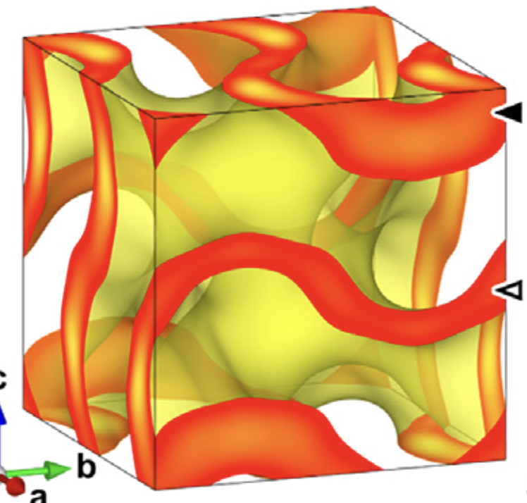

% Chen, Hao 陳浩 Dr. rer. nat. habil.  
%
%

    Assistant Professor, 
    Institute of Mathematical Sciences,
    ShanghaiTech University,
    393 Middle Huaxia Road,
    Pudong, Shanghai, 201210, China
     Tel: +86 21 20680940
    Mail: chenhao5@shanghaitech.edu.cn
    Mail: hao.chen.math@gmail.com
     Web: https://dr-how.github.io/

I'm an Assistant Professor at the [Institute of Mathematical Sciences](https://ims.shanghaitech.edu.cn/ims_en/) at [ShanghaiTech University](http://www.shanghaitech.edu.cn/).

I worked at the [Discrete Differential Geometry Lab](http://ddg.math.uni-goettingen.de/) of the [Georg-August-Univerität Göttingen](https://www.uni-goettingen.de/), funded by DFG individual grant under the project ["Defects in Triply Periodic Minimal Surfaces" (Projekt number 398759432)](http://gepris.dfg.de/gepris/projekt/398759432).  There, I get my Habilitation in June 2021.  Before that, I worked at or visited MSRI (Berkeley), Luxembourg, St Andrews, Eindhoven, and FU Berlin.

I get my PhD at the Free University of Berlin in discrete geometry.  My interest in this direction include polytopes, sphere packings and so on, preferably in non-Euclidean and high dimensional spaces.  I was recently habilitated at the University of Göttingen for differential geometric works, mainly on minimal surfaces and their applications in material sciences.

See my [CV](./documents/CV.pdf) and [research statement](./documents/Research.pdf), also my profile pages on [arXiv](http://arxiv.org/a/chen_h_3), [Google Scholar](https://scholar.google.de/citations?user=SdY1GDkAAAAJ), [MathSciNet](https://mathscinet.ams.org/mathscinet/MRAuthorID/982872), [ORCID](https://orcid.org/0000-0003-1087-2868), [Scopus](https://www.scopus.com/authid/detail.uri?authorId=55206801800), and [publons](https://publons.com/researcher/3094481/hao-chen/).

## Selected Publications

### Minimal surfaces

<table border="0" cellpadding="2" cellspacing="15" width="700">

<tr>
<td style="text-align:right" width="200">

<td>
@. **Gluing Karcher-Scherk saddle towers II: Singly periodic minimal surfaces**
	[![arXiv][arxiv]](http://arxiv.org/abs/2107.06957)
	[![PDF][pdf]](./documents/SinglyTower.pdf)  
	to appear in *Comm. Anal. Geom.*

@. [**Gluing Karcher-Scherk saddle towers I: Triply periodic minimal surfaces**](https://doi.org/10.1515/crelle-2023-0086)
	[![arXiv][arxiv]](http://arxiv.org/abs/2103.15676)
	[![PDF][pdf]](./documents/TriplyTower.pdf)  
	to appear in *J. Reine Angew. Math.*  
	with [Martin Traizet][traizet].

We glue saddle towers into minimal surfaces without any assumption on the symmetry.  In particular, we reveal a subtle vertical interaction between the tower, which was not perceived in previous constructions.  This is the first paper presenting such our construction.  We discovered many new triply and singly periodic minimal surfaces.  For singly periodic ones, we address the technical issue of embeddedness when Scherk ends are initially parallel.  Fig. on the left from <a href="https://minimalsurfaces.blog/home/repository/triply-periodic/schoen-h-t/">Matthias Weber's repository</a>.
</tr>

<tr>
<td style="text-align:right" width="200">

<td>
@. [**Catenoid limits of singly periodic minimal surfaces with Scherk-type ends**](https://doi.org/10.2140/pjm.2023.325.11)
	[![arXiv][arxiv]](http://arxiv.org/abs/2206.08550)
	[![PDF][pdf]](./documents/DegenerateTower.pdf)  
	in *Pacific J. Math.*  
	with [Peter Connor][connor] and Kevin Li.

We reproduce the result in the PhD thesis of Kevin Li.  More specifically, we construct families of embedded, singly periodic Karcher--Scherk saddle towers that look like parallel planes connected by small catenoid necks.
</tr>

<tr>
<td style="text-align:right" width="200">

<td>
@. [**Helicoids and vortices**](https://doi.org/10.1098/rspa.2022.0431)
	[![arXiv][arxiv]](http://arxiv.org/abs/2201.13091)
	[![PDF][pdf]](./documents/Vortices.pdf)  
	in *Proc. R. Soc. A.*  
	with Daniel Freese.

We show that the interaction between helicoids during a gluing construction is the same as the interaction between point vortices in 2D fluids. As a consequence, we obtained many new examples of minimal surfaces and some new examples of vortex crystals. Photo on the left is by Toshio Kobayashi 小林敏雄 in the photo album 流れ―写真集. It corresponds to the rPD minimal surface.
</tr>

<tr>
<td style="text-align:right" width="200">

<td>
@. [**Existence of the rhombohedral and tetragonal deformation families of the gyroid**](https://doi.org/10.1512/iumj.2021.70.8505)
	[![arXiv][arxiv]](http://arxiv.org/abs/1901.04006)
	[![PDF][pdf]](./documents/tGrGL.pdf)  
	in *Indiana Univ. Math. J.*
	
We prove the existence of two 1-parameter families discovered in the 1990's, namely the tetragonal (tG) and rhombohedral (rGL) deformation families of the gyroid.  The proof defines Weierstrass data in terms of Jacobi sn function on flat tori that are not necessarily rectangular.  Then we notice twisted catenoids bounded by curved squares and triangles, which allow us to propose a period condition following an intuition of Gross-Brauckmann.  Another key observation is that CLP surfaces can be seen as a special gyrating surface.
</tr>

<tr>
<td style="text-align:right" width="200">

<td>
@. [**Stacking disorder in periodic minimal surfaces**](https://doi.org/10.1137/20M1312137)
	[![arXiv][arxiv]](http://arxiv.org/abs/1908.06276)
	[![PDF][pdf]](./documents/Disorder.pdf)  
	in *SIAM J. Math. Anal.*  
	with [Martin Traizet][traizet].

We fonstruct a rich variety of doubly periodic minimal surfaces of infinite genus.  They lift to minimal surfaces in the Euclidean space that are periodic in two independent horizontal directions, but non-periodic in the vertical direction.  In the language of crystallography, our examples should be considered as disordered stacking of catenoid necks.  The TPMS twinning is then just a special case. 
</tr>

<tr>
<td style="text-align:right" width="200">

<td>
@. [**An orthorhombic deformation family of Schwarz' H surfaces**](https://doi.org/10.1090/tran/8275)
	[![arXiv][arxiv]](http://arxiv.org/abs/1807.10631)
	[![PDF][pdf]](./documents/oH.pdf)  
	in *Trans. Amer. Math. Soc.*  
	with [Matthias Weber][weber].

@. [**A new deformation family of Schwarz' D surface**](https://doi.org/10.1090/tran/8274)
	[![arXiv][arxiv]](http://arxiv.org/abs/1804.01442)
	[![PDF][pdf]](./documents/oD.pdf)  
	in *Trans. Amer. Math. Soc.*  
	with [Matthias Weber][weber].

These two papers show, respectively, two new 2-dimensional families of triply periodic minimal surfaces of genus three, which can be seen as orthorhombic deformations of Schwarz' D and H surfaces.  These families are exceptional since they do not belong to Meeks' 5-dimensional family, yet the 1-dimensional "intersections" with Meeks family exhibit singularities in the moduli space of triply periodic minimal surfaces of genus three.  Picture on the left compares a new surface with the classical Schwarz tD surface.  See <a href="https://theinnerframe.wordpress.com/2018/04/09/fake-diamonds/">Matthias blog post</a> for a gentle introduction.
</tr>

<tr>
<td style="text-align:right" width="200">

<td>
@. [**Minimal Twin Surfaces**](https://doi.org/10.1080/10586458.2017.1413455)
	[![arXiv][arxiv]](http://arxiv.org/abs/1610.07926)
	[![PDF][pdf]](./documents/Twin.pdf)  
	in *Exp. Math.*

We report some minimal surfaces that can be seen as copies of a triply periodic minimal surface (TPMS) related by reflections in parallel mirrors. We call them minimal twin surfaces for the resemblance with twin crystal. Brakke’s Surface Evolver is employed to construct twinnings of various classical TPMS, including Schwarz’ Primitive (P) and Diamond (D) surfaces, their rhombohedral deformations (rPD), and Schoen’s Gyroid (G) surface. Our numerical results provide strong evidences for the mathematical existence of D twins and G twins, which are recently observed in experiment by material scientists. For rPD twins, we develop a good understanding, by noticing examples previously constructed by [Traizet 08] and [Fujimori and Weber 09]. Our knowledge on G twins is, by contrast, very limited. Nevertheless, our experiments lead to new cubic polyhedral models for the D and G surfaces, inspired by which we speculate new TPMS deformations in the framework of Traizet. 
</tr>
</table>

### Discrete Geometry

<table border="0" cellpadding="2" cellspacing="15" width="700">

<tr>
<td style="text-align:right" width="200">

<td>
@. [**Weakly Inscribed Polyhedra**](http://dx.doi.org/10.1090/btran/59)
	[![arXiv][arxiv]](http://arxiv.org/abs/1709.10389)
	[![PDF][pdf]](./documents/Steiner.pdf)  
	in *Trans. Amer. Math. Soc. Ser. B*  
	with [Jean-Marc Schlenker][schlenker].

We study convex polyhedra in the projective 3-space with all their vertices on a sphere. We do not require, in particular, that the polyhedra lie in the interior of the sphere, hence the term "weakly inscribed". Such polyhedra can be interpreted as ideal polyhedra, if we regard the projective space as a combination of the hyperbolic space and the de Sitter space, with the sphere as the common ideal boundary. We have three main results: (1) the 1-skeleta of weakly inscribed polyhedra are characterized in a purely combinatorial way, (2) the exterior dihedral angles are characterized by linear programming, and (3) we also describe the hyperbolic-de Sitter structure induced on the boundary of weakly inscribed polyhedra.
</tr>

<tr>
<td style="text-align:right" width="200">

<td>
@. [**Selectively Balancing Unit Vectors**](https://doi.org/10.1007/s00493-016-3635-z)
	[![arXiv][arxiv]](http://arxiv.org/abs/1605.05121)
	[![PDF][pdf]](./documents/Balancing.pdf)  
	in *Combinatorica*  
	with [Aart Blokhuis][blokhuis].

A set U of unit vectors is selectively balancing if one can find two disjoint subsets U+ and U-, not both empty, such that the Euclidean distance between the sum of U+ and the sum of U- is smaller than 1. We prove that the minimum number of unit vectors that guarantee a selectively balancing set in ℝ n is asymptotically nlogn/2. 
</tr>

<tr>
<td style="text-align:right" width="200">

<td>
@. [**Scribability problems for polytopes**](https://doi.org/10.1016/j.ejc.2017.02.006)
	[![arXiv][arxiv]](http://arxiv.org/abs/1508.03537)
	[![PDF][pdf]](./documents/Scribability.pdf)  
	in *European J. Combin.*  
	with [Arnau Padrol][padrol].

In this paper we study various scribability problems for polytopes. We begin with the classical k-scribability problem proposed by Steiner and generalized by Schulte, which asks about the existence of d-polytopes that cannot be realized with all k-faces tangent to a sphere. We answer this problem for stacked and cyclic polytopes for all values of d and k. We then continue with the weak scribability problem proposed by Gr\"unbaum and Shephard, for which we complete the work of Schulte by presenting non weakly circumscribable 3-polytopes. Finally, we propose new (i,j)-scribability problems, in a strong and a weak version, which generalize the classical ones. They ask about the existence of d-polytopes that can not be realized with all their i-faces "avoiding" the sphere and all their j-faces "cutting" the sphere. We provide such examples for all the cases where j−i≤d−3. 
</tr>

<tr>
<td style="text-align:right" width="200">

<td>
@. [**Ball packings with high chromatic numbers from strongly regular graphs**](https://doi.org/10.1016/j.disc.2017.03.006)
	[![arXiv][arxiv]](http://arxiv.org/abs/1502.02070)
	[![PDF][pdf]](./documents/SRG.pdf)  
	in *Discrete Math.*

Inspired by Bondarenko's counter-example to Borsuk's conjecture, we notice some strongly regular graphs that provide examples of ball packings whose chromatic numbers are significantly higher than the dimensions. In particular, from generalized quadrangles we obtain unit ball packings in dimension q3−q2+q with chromatic number q3+1, where q is a prime power. This improves the previous lower bound for the chromatic number of ball packings.  (Fig. on the left from <a href="https://en.wikipedia.org/wiki/Clebsch_graph">Wikipedia</a>) 
</tr>

<tr>
<td style="text-align:right" width="200">

<td>
@. [**Even More Infinite Ball Packings from Lorentzian Root Systems**](https://doi.org/10.37236/4989)
	[![arXiv][arxiv]](http://arxiv.org/abs/1408.2439)
	[![PDF][pdf]](./documents/MorePack.pdf)  
	in *Electron. J. Combin.*

@. [**Lorentzian Coxeter systems and Boyd-Maxwell ball packings**](http://doi.org/10.1007/s10711-014-0004-1)
	[![arXiv][arxiv]](http://arxiv.org/abs/1310.8608)
	[![PDF][pdf]](./documents/BoydPack.pdf)  
	in *Geom. Dedicata*  
	with [Jean-Philippe Labbé][labbe]

These two papers generalize the infinite ball packings generated by Coxeter groups proposed by Boyd (1974) and Maxwell (1983).  It is motivated by recent studies on infinite root systems.  It turns out that the accumulation points of the roots in the projective space leave a pattern of spheres on the light cone.  We first noticed a connection between this pattern and the Boyd-Maxwell packings, then extend this connection to a more general notion of root system.  In particular, we enumerate all the Coxeter groups of "level 2", which are all the Coxeter groups that generate a ball packing.  See also the <a target="_blank" href="https://www.shadertoy.com/view/NdK3zy">Shadertoy implementation</a> of Boyd-Maxwell packings by <a target="_blank" href="https://twitter.com/neozhaoliang">@neozhaoliang</a>.
</tr>

<tr>
<td style="text-align:right" width="200">

<td>
@. [**Limit Directions for Lorentzian Coxeter Systems**](https://doi.org/10.4171/GGD/404)
	[![arXiv][arxiv]](http://arxiv.org/abs/1403.1502)
	[![PDF][pdf]](./documents/LimitDir.pdf)  
	in *Groups Geom. Dyn.*  
	with [Jean-Philippe Labbé][labbe]

Every Coxeter group admits a geometric representation as a group generated by reflections in a real vector space. In the projective representation space, limit directions are limits of injective sequences in the orbit of some base point. Limit roots are limit directions that can be obtained starting from simple roots. In this article, we study the limit directions arising from any point when the representation space is a Lorentz space. In particular, we characterize the light-like limit directions using eigenvectors of infinite-order elements. This provides a spectral perspective on limit roots, allowing for efficient computations. Moreover, we describe the space-like limit directions in terms of the projective Coxeter arrangement. 
</tr>

<tr>
<td style="text-align:right" width="200">

<td>
@. [**Apollonian Ball Packings and Stacked Polytopes**](https://doi.org/10.1007/s00454-016-9777-3)
	[![arXiv][arxiv]](http://arxiv.org/abs/1306.2515)
	[![PDF][pdf]](./documents/Stacked.pdf)  
	in *Discrete Comput. Geom.*

We investigate in this paper the relation between Apollonian d-ball packings and stacked (d+1)-polytopes for dimension d≥3 . For d=3, the relation is fully described: we prove that the 1-skeleton of a stacked 4-polytope is the tangency graph of an Apollonian 3-ball packing if and only if there is no six 4-cliques sharing a 3-clique. For higher dimension, we have some partial results. (Fig. on the left from <a href="https://en.wikipedia.org/wiki/Soddy%27s_hexlet">Wikipedia</a>) 
</tr>
</table>

### Physics

<table border="0" cellpadding="2" cellspacing="15" width="700">

<tr>
<td style="text-align:right" width="200">

<td>
@. [**Tetragonal gyroid structure from symmetry manipulation: A brand-new member of the gyroid surface family**](https://doi.org/10.1016/j.chempr.2023.12.017)
	[![PDF][pdf]](./documents/ShiftG.pdf)  
	in *Chem*  
	with Shuqi Wang, Tianyu Zhong, Quanzheng Deng, Shaobo Yang, Yuanyuan Cao, Yongsheng Li, Lu Han
	
We report a tetragonal G substructure (shifted tG) in which one skeleton is shifted in the 001 direction, creating a periodic distributions of uneven matrix thicknesses.  I contributed with an explanation of the structure through a free energy that is locally concave in the matrix thickness.
</tr>
	
<tr>
<td style="text-align:right" width="200">

<td>
@. [**Direct imaging of the structural transition and interconversion of macroporous bicontinuous diamond-surface structure**](https://doi.org/10.1016/j.micromeso.2021.111084)
	[![PDF][pdf]](./documents/L-DD.pdf)  
	in *Micropor. Mesopor. Mat.*  
	with Chao Bao, Shun'ai Che, Lu Han

@. [**Self-Assembly of Single Diamond Surface Networks**](https://doi.org/10.1002/anie.202102056)
	[![PDF][pdf]](./documents/SD-SG.pdf)  
	in *Angew. Chem. Int.*  
	with Qingqing Sheng, Wenting Mao, Congcong Cui, Shun'ai Che, Lu Han

The first paper reports intermediate structures during the transition between lamellar phases and bicontinuous diamond phases.  The second paper reports a coexistence of single diamond and single gyroid structures.  I contributed in both with explanations of the experimental observations inspired by the node-opening technique in differential geometry.
</tr>

<tr>
<td style="text-align:right" width="200">

<td>
@. [**Competition brings out the best: modelling the frustration between curvature energy and chain stretching energy of lyotropic liquid crystals in bicontinuous cubic phases**](http://doi.org/10.1098/rsfs.2016.0114)
	[![arXiv][arxiv]](http://arxiv.org/abs/1702.04172)
	[![PDF][pdf]](./documents/Bilayer.pdf)  
	in *Interface Focus*  
	with [Chenyu Jin](https://scholar.google.de/citations?user=4rlI2JsAAAAJ).

It is commonly considered that the frustration between the curvature energy and the chain stretching energy plays an important role in the formation of lyotropic liquid crystals in bicontinuous cubic phases. Theoretic and numeric calculations were performed for two extreme cases: parallel surfaces eliminate the variance of the chain length; constant mean curvature surfaces eliminate the variance of the mean curvature. We have implemented a model with Brakke's Surface Evolver which allows a competition between the two variances. The result shows a compromise of the two limiting geometries. With data from real systems, we are able to recover the gyroid–diamond–primitive phase sequence which was observed in experiments. 
</tr>

<tr>
<td style="text-align:right" width="200">

<td>
@. [**Crystal twinning of bicontinuous cubic structures**](https://doi.org/10.1107/S2052252519017287)
	[![PDF][pdf]](./documents/HLTwin.pdf)  
	in *IUCrJ*  
	with Lu Han, Nobuhisa Fujita, Chenyu Jin, Osamu Terasaki, Shun'ai Che.

A collaboration with physicists.  We performed an in-depth analysis of the twinning structures observed in experiments.
</tr>

<tr>
<td style="text-align:right" width="200">

<td>
@. **Comment on "Analysis of hospital traffic and search engine data in Wuhan China indicates early disease activity in the Fall of 2019" by Nsoesie et al.**
	[![PDF][pdf]](./documents/COVID19.pdf)
	[DASH](https://dash.harvard.edu/handle/1/42689379)
	[HAL](https://hal.archives-ouvertes.fr/hal-02897822)  
	with Ziming Du, Yu Kang, Zhenyu Lin, Zhenjun Ma

This is our attempt to fight against the trend of problematic studies being announced by press release.  In this case, it is a Harvard study that "analyses" satellite images of hospital parking lots and internet search trends, and suggests that the COVID-19 outbreak started in Wuhan, China in August 2019, four months earlier than documented.  We identify many problems in this study, including but not limited to: inappropriate and insufficient data, misuse and misinterpretation of statistical methods, and cherry-picking internet search terms. We also reflect on scientific publishing in a time of public emergency.
</tr>

</table>

 [connor]: https://pconnor.pages.iu.edu/
 [schlenker]: http://math.uni.lu/schlenker/
 [weber]: http://pages.iu.edu/~matweber/
 [traizet]: http://www.lmpt.univ-tours.fr/~traizet/
 [blokhuis]: http://www.win.tue.nl/~aartb/
 [padrol]: http://page.mi.fu-berlin.de/arnaupadrol/
 [jost]: http://www.mis.mpg.de/jjost/juergen-jost.html
 [labbe]: http://page.mi.fu-berlin.de/labbe/
 [pdf]: ./images/pdf.png
 [arxiv]: ./images/arXiv.ico
